# 🧅 onion-store

> 상품 조회부터 장바구니, 주문·결제, 환불, 판매자-고객 실시간 채팅까지 지원하는 커머스 백엔드 프로젝트

회원이 상품을 조회·좋아요하고 장바구니에 담아 주문·결제·환불까지 진행할 수 있으며,
주문 중 발생하는 CS 문의를 실시간 채팅(WebSocket/STOMP)으로 처리할 수 있는 **커머스 플랫폼**입니다.


## Links

- 배포 링크: [https://chungmani.click](https://chungmani.click/)

---

## 🚀 시작하기 (Getting Started)

### 요구 사항

| 항목      | 버전                                   |
| ------- | ------------------------------------ |
| JDK     | 17 (Gradle toolchain으로 자동 감지)        |
| Gradle  | Wrapper 포함 (`./gradlew`, 별도 설치 불필요)   |
| Node.js | 20.x (프론트엔드 빌드)                      |
| MySQL   | 8.4 (Docker Compose로 제공)             |
| Redis   | 7.4 (Docker Compose로 제공)             |

### 1. 인프라(MySQL, Redis) 실행

프로젝트 루트의 `docker-compose.yml`로 MySQL·Redis 컨테이너를 띄웁니다.

```bash
docker compose up -d mysql redis
```

| 항목            | 값                                             |
| ------------- | --------------------------------------------- |
| DB            | `onion_store`                                  |
| Host / Port   | `localhost:3307` (컨테이너 내부는 `3306`)             |
| User / Password | `onion` / `onion` (root: `root1234`)         |
| Redis Port    | `localhost:6379`                               |

### 2. 백엔드 실행 (local profile)

```bash
./gradlew bootRun --args='--spring.profiles.active=local'
```

또는 IDE(IntelliJ)에서 `local` 프로파일을 지정해 `OnionStoreApplication`을 실행합니다.

> ⚠️ PortOne 연동 기능(결제/웹훅)을 테스트하려면 `PORTONE_API_SECRET`, `PORTONE_STORE_ID`, `PORTONE_CHANNEL_KEY`, `PORTONE_WEBHOOK_SECRET` 환경 변수가 필요합니다. `docker-compose.yml`의 `app` 서비스로 함께 띄우거나 로컬 실행 시 환경 변수로 주입하세요.

### 3. 프론트엔드 실행

```bash
cd frontend
npm install
npm run dev
```

`frontend/.env.example`을 참고해 `.env`를 만들고 `VITE_API_BASE_URL`을 실행 중인 백엔드 주소로 맞춰주세요.

### 4. 테스트 & 커버리지

```bash
./gradlew test
```

테스트 종료 후 JaCoCo 리포트가 자동 생성됩니다.

```
build/reports/jacoco/test/html/index.html
```

### 5. Docker 이미지 빌드/실행

```bash
docker build -t onion-store .
docker run -p 8080:8080 --env SPRING_PROFILES_ACTIVE=prod onion-store
```

---

## 🛠 개발 환경

| 구분          | 사용 기술                                                              |
| ----------- | ------------------------------------------------------------------ |
| Frontend    | React 18, TypeScript, Vite, React Router, Axios, STOMP.js           |
| Backend     | Java 17, Spring Boot 4.1.1                                          |
| Database    | MySQL 8.4, Spring Data JPA, QueryDSL, Flyway                        |
| Cache       | Redis 7.4, Caffeine (로컬 캐시)                                        |
| 인증          | Spring Security, JWT(OAuth2 Resource Server)                       |
| 실시간 통신      | WebSocket, STOMP                                                    |
| 외부 결제       | PortOne Server SDK (결제 확인, 웹훅 검증)                                  |
| 문서·테스트      | Swagger(springdoc), JUnit 5, Testcontainers, JaCoCo                 |
| 로컬 컨테이너 구성  | Docker Compose (애플리케이션·MySQL·Redis)                                |
| CI/CD       | GitHub Actions                                                      |
| AWS 인프라     | S3, CloudFront, EC2, RDS, ElastiCache Redis, ECR, Systems Manager Parameter Store |

프론트엔드는 Vite 개발 서버로 실행하며 `.env`의 `VITE_API_BASE_URL`로 백엔드 주소를 설정한다. 백엔드는 `local` 프로필에서 Docker Compose의 MySQL·Redis를 사용하고, PortOne 관련 키는 환경 변수로 주입한다. 운영 환경에서는 S3와 CloudFront로 프론트엔드 정적 파일을 제공하고, EC2에서 Docker 컨테이너로 실행되는 Spring Boot 애플리케이션이 RDS·ElastiCache Redis에 연결된다. 애플리케이션은 AWS Parameter Store에서 DB·JWT·PortOne 설정을 불러온다.

---

## 🏗 전체 아키텍처 흐름

### 서비스 요청 흐름

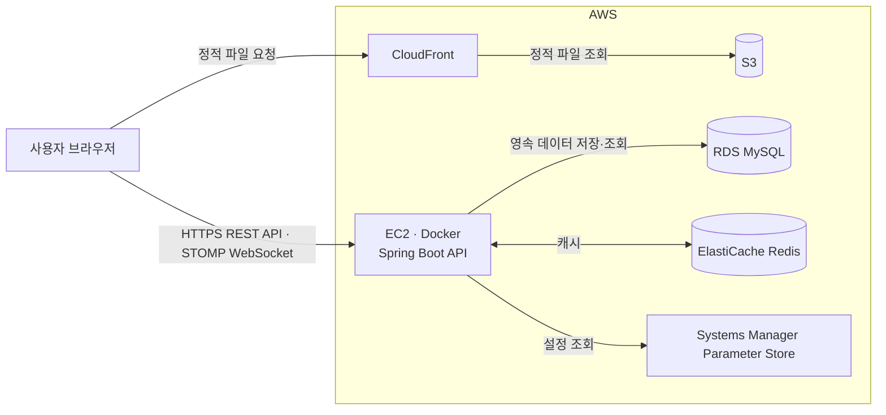

CloudFront는 S3에 배포된 React 정적 파일을 사용자에게 제공한다. API와 WebSocket 요청은 EC2에서 Docker 컨테이너로 실행되는 Spring Boot 애플리케이션이 직접 처리한다. 애플리케이션 내부에서는 JWT 인증 뒤 Controller, Facade/Service, Repository 순서로 요청을 처리한다.

영속 데이터의 원본은 RDS MySQL이며, 상품 정보·재고·좋아요·인기 상품·카테고리처럼 반복 조회가 많은 데이터는 ElastiCache Redis를 캐시로 사용한다. 민감한 DB·JWT·PortOne 설정은 Parameter Store에서 불러온다.

### 결제 흐름

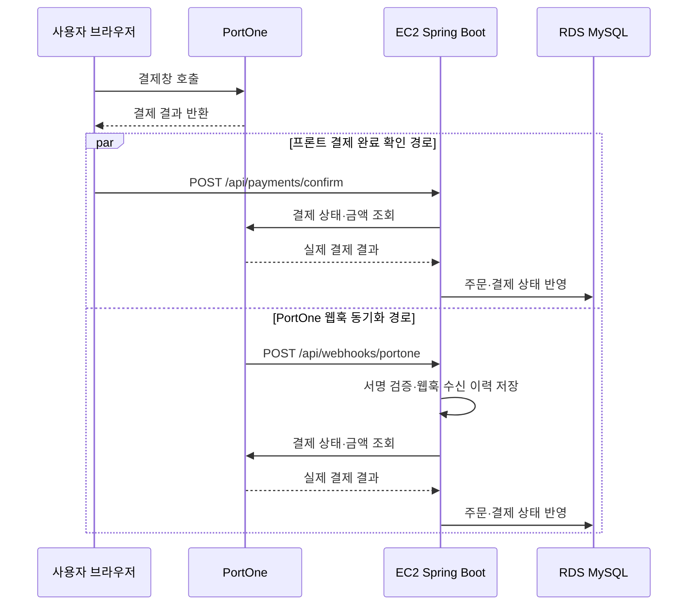

프론트 결제 완료 확인 요청과 PortOne 웹훅은 순서와 관계없이 각각 결제 확정의 진입점이 된다. 두 경로 모두 PortOne API에서 결제 상태와 금액을 다시 조회해 검증한 뒤 주문·결제 상태를 반영한다. 웹훅은 서명을 검증하고 수신 이력을 저장해 중복 수신을 구분한다.

### 실시간 채팅 흐름

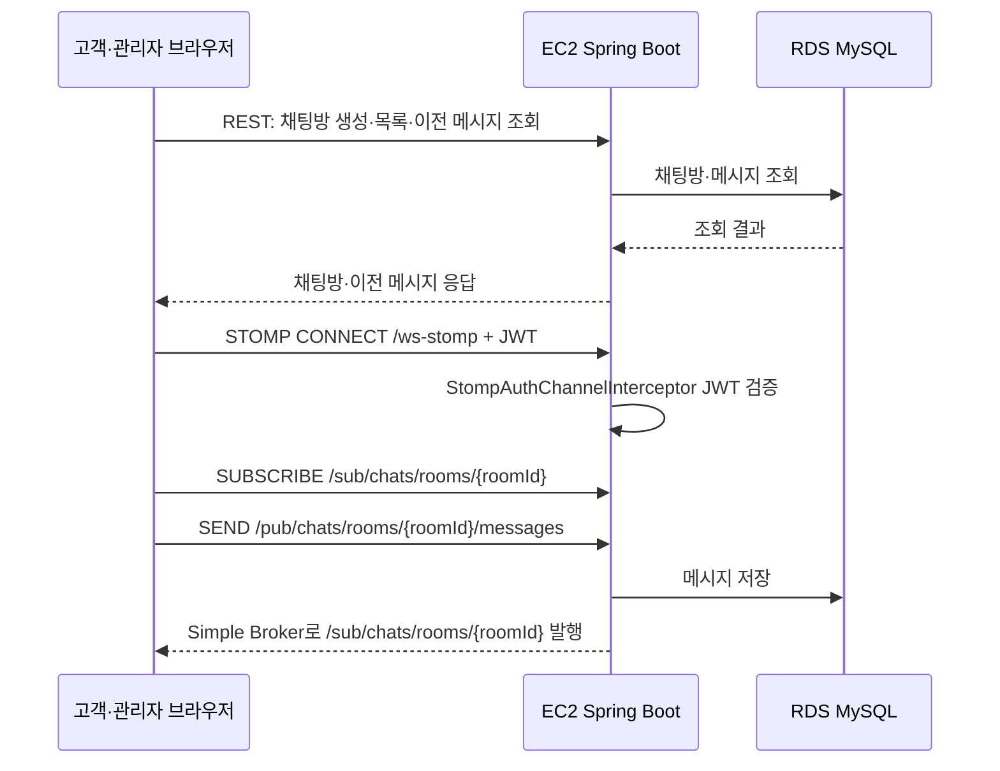

채팅방 생성·목록·이전 메시지 조회는 REST API로 처리한다. 실시간 메시지는 WebSocket STOMP 연결(`/ws-stomp`)을 사용하며, CONNECT 프레임의 JWT를 `StompAuthChannelInterceptor`로 검증한 뒤 채팅방 구독·발행을 허용한다. 메시지는 RDS에 먼저 저장하고 Spring의 Simple Broker가 같은 채팅방 구독자에게 `/sub/chats/rooms/{roomId}`로 전달한다.

### CI/CD 배포 흐름

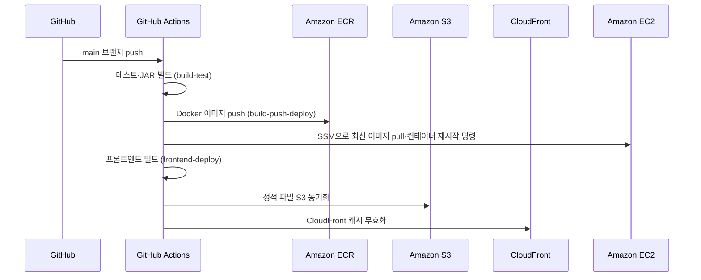

`main` 브랜치에 변경이 반영되면 GitHub Actions가 테스트와 JAR 빌드를 수행한 뒤 Docker 이미지를 빌드해 ECR에 올리고, Systems Manager 명령으로 EC2의 컨테이너를 최신 이미지로 교체한다(`/actuator/health`로 기동 확인). 프론트엔드는 별도 잡에서 빌드 후 S3에 동기화하고 CloudFront 캐시를 무효화한다. 세 잡 모두 `build-test`가 통과해야 진행된다.

---

## 📌 ERD

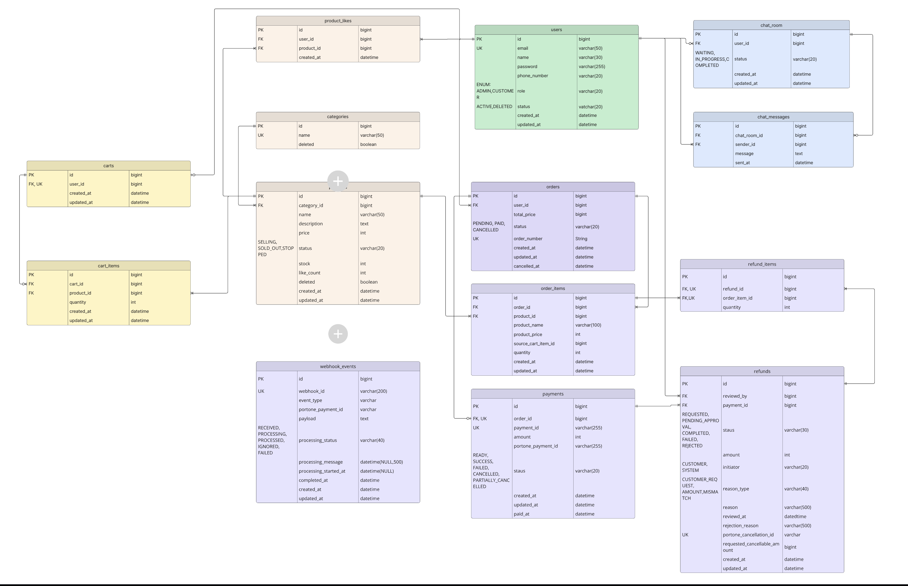

users(회원) - product_likes/products/categories(상품·좋아요·카테고리) - carts/cart_items(장바구니) - orders/order_items(주문) - payments(결제) - refunds/refund_items(환불) - chat_room/chat_messages(채팅) - webhook_events(PortOne 웹훅 수신 이력)로 구성된다. 주문은 결제 1건과 1:1로 연결되고, 환불은 주문 항목(order_items) 단위로 refund_items에 매핑된다.

---

## 📊 도메인별 플로우차트

### 회원 (가입·로그인·정보관리·탈퇴)

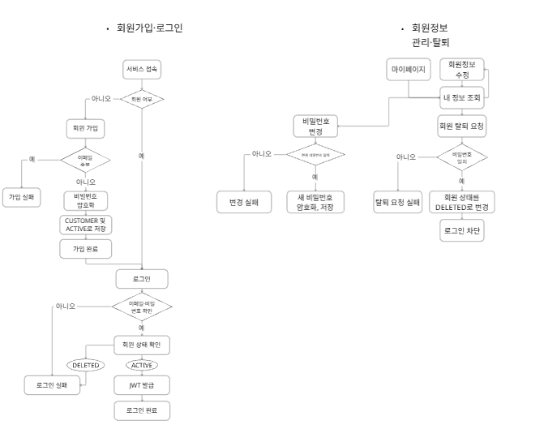

가입 시 이메일 중복을 확인하고 비밀번호를 암호화해 `CUSTOMER`/`ACTIVE` 상태로 저장한다. 로그인은 이메일·비밀번호 확인 후 회원 상태가 `ACTIVE`일 때만 JWT를 발급한다(`DELETED`면 로그인 실패). 탈퇴는 비밀번호 재확인 후 상태를 `DELETED`로 바꾸고 이후 로그인을 차단한다.

### 상품 (등록·수정·삭제·재고 감소)

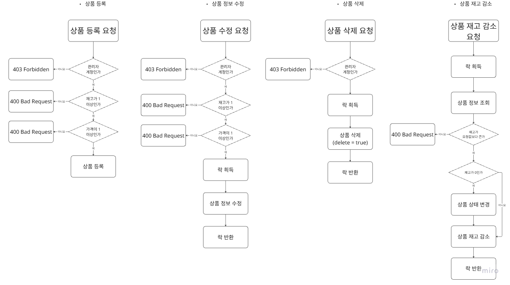

등록/수정/삭제는 모두 관리자 계정 여부를 먼저 확인하고(`403 Forbidden`), 재고·가격 등 입력값을 검증한다(`400 Bad Request`). 재고 감소는 락을 획득한 뒤 요청 수량과 현재 재고를 비교하고, 재고가 0이 되면 상품 상태를 함께 변경한 후 락을 반환한다.

### 장바구니

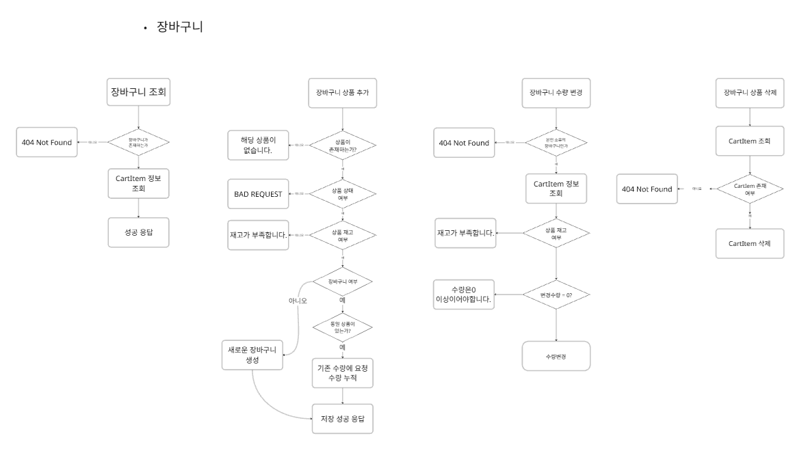

담기는 상품 존재·판매 상태·재고를 확인한 뒤, 동일 상품이 이미 담겨 있으면 수량을 누적하고 없으면 새 항목을 생성한다. 수량 변경·삭제는 본인 장바구니인지, 대상 항목이 존재하는지 확인한 뒤 처리하며, 변경 수량은 0 이상이어야 한다.

### 주문

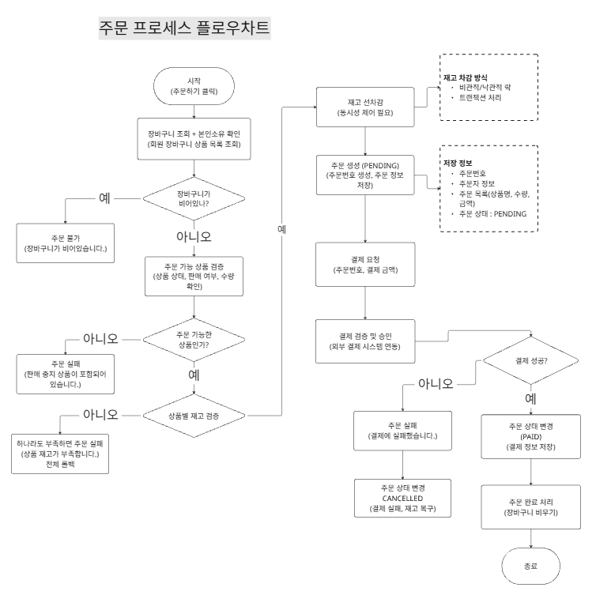

주문 생성 시 장바구니가 본인 소유인지, 비어 있지 않은지 확인하고 상품별 판매 상태·재고를 검증한 뒤 재고를 선차감하고 `PENDING` 주문을 생성한다. 이어서 결제를 요청하고, 결제 성공 시 주문 상태를 `PAID`로 바꾸고 장바구니를 비우며, 실패 시 재고를 복구하고 주문을 `CANCELLED`로 전환한다.

### 결제

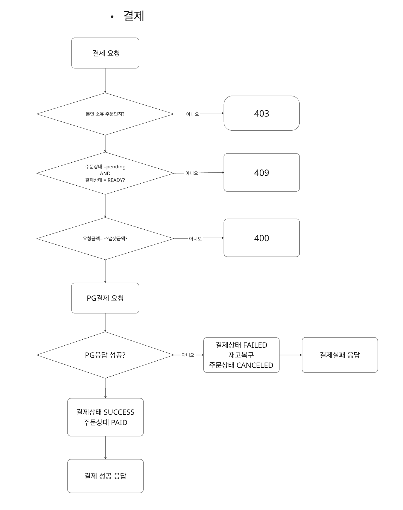

결제 요청은 본인 주문인지, 주문 상태가 `PENDING`·결제 상태가 `READY`인지, 요청 금액이 서버가 들고 있는 스냅샷 금액과 일치하는지 순서대로 검증한 뒤(불일치 시 각각 403/409/400) PG(PortOne)에 결제를 요청한다. PG 응답이 실패면 결제 상태를 `FAILED`로, 성공이면 `SUCCESS`/주문 `PAID`로 반영한다.

### 실시간 채팅

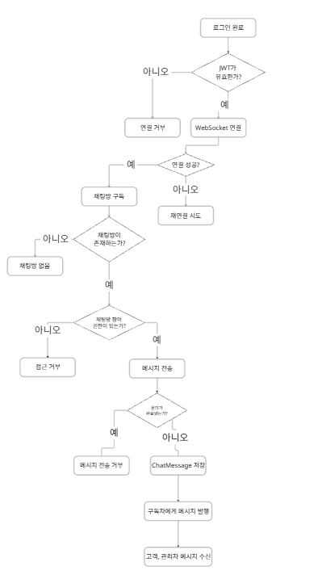

로그인 후 JWT가 유효할 때만 WebSocket 연결을 허용하고, 채팅방 구독 시 채팅방 존재 여부와 참여 권한을 확인한다. 메시지 전송은 본문이 비어 있지 않은 경우에만 `ChatMessage`로 저장한 뒤 구독자(고객·관리자)에게 실시간으로 발행(broadcast)한다.

---

## 📌 주요 도메인 구조

### 패키지 구조

```
com.example.onionstore
├── domain
│   ├── user      # 회원가입 / 로그인 / 내 정보 / 비밀번호 변경 / 탈퇴
│   ├── product   # 상품 조회, 등록/수정, 좋아요
│   ├── category  # 카테고리 CRUD (캐시 적용)
│   ├── cart      # 장바구니 담기 / 조회 / 수량 변경 / 삭제
│   ├── order     # 주문 생성, 조회, 상태 변경, 취소
│   ├── payment   # 결제 확인, PortOne 연동, 웹훅 상태 반영
│   ├── refund    # 고객 환불 요청 / 관리자 환불 심사
│   └── chat      # 채팅방 생성·목록·상세, 메시지 내역(커서), STOMP 실시간 메시지
├── infra
│   ├── client    # PortOne 연동 클라이언트/설정
│   ├── redis     # Redis 캐시 구현체 (상품/좋아요/인기상품/재고/카테고리)
│   └── webhook   # PortOne 웹훅 수신·검증·처리
└── global
    ├── config     # Security, Cache, Redis, Querydsl, Swagger, WebSocket 등 공통 설정
    ├── security   # JWT 인증/인가
    ├── exception  # 공통 예외 처리 (BusinessException, ErrorCode)
    ├── dto        # 공통 응답 포맷(ApiResponse)
    └── entity     # 공통 엔티티(BaseTimeEntity 등)
```

각 도메인 하위는 `controller / service / facade / repository / entity / dto` 구조를 따르며, 여러 도메인을 조합해야 하는 로직(주문 생성 시 재고 차감, 결제-주문 상태 동기화 등)은 `facade`에서 처리한다.

### 도메인별 주요 기능

| 도메인      | 주요 기능                                                   |
| -------- | ------------------------------------------------------- |
| user     | 회원가입, 로그인(JWT 발급), 내 정보 조회/수정, 비밀번호 변경, 탈퇴               |
| product  | 상품 목록/상세 조회(카테고리·가격 필터, 페이지네이션), 좋아요, Redis 캐시            |
| category | 카테고리 등록/수정, 캐시 적용 조회                                    |
| cart     | 장바구니 담기/조회/수량 변경/삭제                                     |
| order    | 주문 생성(재고 선차감), 주문 목록/상세 조회, 상태 변경, 취소                    |
| payment  | 결제 확인(`PortOne` 상태·금액 검증), 웹훅 동기화                       |
| refund   | 고객 환불 요청, 관리자 환불 승인/반려                                  |
| chat     | 채팅방 생성/목록/상세, 메시지 내역 조회(커서 기반), STOMP 실시간 메시지 송수신       |

---

## 🎨 와이어프레임

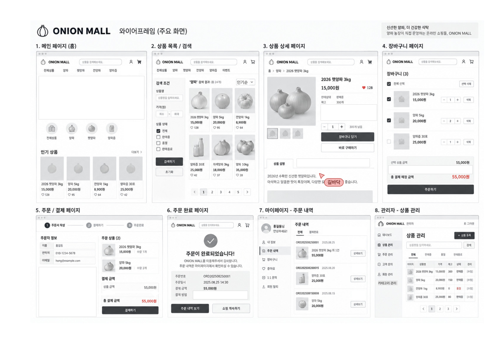

---

# 🧑‍💻 Contributors

<a href="https://github.com/chungmani"></a>&nbsp;&nbsp;&nbsp;&nbsp;
<a href="https://github.com/trex1004"></a>&nbsp;&nbsp;&nbsp;&nbsp;
<a href="https://github.com/chaeb0414-collab"></a>&nbsp;&nbsp;&nbsp;&nbsp;
<a href="https://github.com/xevbn"></a>&nbsp;&nbsp;&nbsp;&nbsp;
<a href="https://github.com/taeribo"></a>&nbsp;&nbsp;&nbsp;&nbsp;
